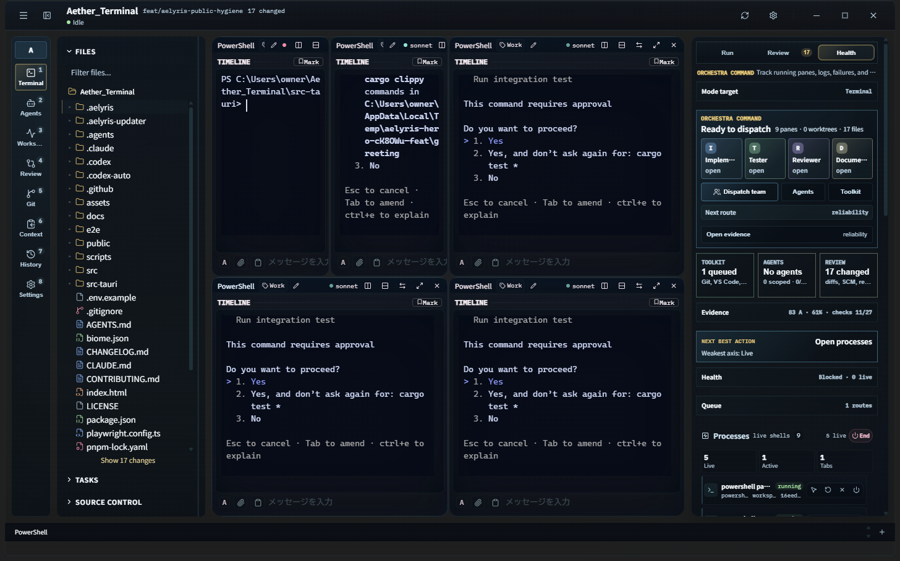

**English** | [日本語](README.ja.md)

# Aelyris

Aelyris — project-first AI development workspace for Windows.



> Development screenshot of the alpha: visible agent panes, each an interactive
> agent CLI in its own git worktree, with the orchestrator rail on the right.
> Multi-agent parallel dispatch into the central pane tree is still gated
> (`verify:agent-team-orchestration-readiness` is not yet green) — this shows the
> substrate, not a proven parallel-fleet guarantee. See status and limitations below.

Aelyris is a Tauri desktop app that combines a real terminal workspace,
visible AI-agent panes, project/worktree context, review and merge controls, and
machine-checked release gates. The long-term target is not just another terminal
tab manager: Aelyris is being built as an auditable operating surface for AI
development teams.

## Current Status

**Alpha / active development. Not release-ready.**

The repository is public-previewable, but the product must not yet claim
tmux-equivalent, BridgeSpace-plus, Ghostty/WezTerm-class, world-class terminal AI
OS, release-ready status, or strict `agmsg` superset behavior.

Latest documented machine evidence, generated locally on 2026-06-29 JST. Regenerate with `pnpm verify:quality-score`, `pnpm verify:goal:safe`, and `pnpm verify:world-class-terminal-ai-os` before making release claims:

- `release-quality-score`: `35/100`, `124/351`, grade `D`
- `releaseCandidateReady`: `false`
- Machine field: `releaseCandidateReady=false`
- `final-goal-safe`: `ok=false`, `status=blocked`
- `requirements-spec-design-traceability`: `pass-doc-traceability-current`
- `world-class-terminal-ai-os`: `status=external-blocked`

The current defensible claim is:

> Aelyris has a real Rust/Tauri terminal, mux, sidecar, visible-agent, MCP,
> worktree, ownership, review, and merge substrate. The world-class product claim
> is still blocked by live durability, restart/replay, native-quality,
> signing/updater, and external operator-proof gates.

## What Aelyris Is

Aelyris is designed around this target workflow:

1. Open a project, not just a shell.
2. Split work into visible agent lanes.
3. Route agents toward inspectable terminal panes, with visible PTY paths
   already implemented and full pane-tree orchestration still gated.
4. Keep work isolated through worktrees and ownership claims.
5. Review, approve, and merge through an auditable control layer.
6. Treat product claims as gates backed by scripts and artifacts, not prose.

## Implemented Substrate

- Windows terminal runtime: Tauri v2, Rust backend, WebView2 frontend, ConPTY,
  xterm.js, and native terminal experiments.
- Pane and mux layer: pane tree, split layouts, persisted pane state, mux graph,
  sidecar direction, and a tmux-grade-contract verifier whose live mux-restore
  proof is still gated.
- Visible AI agents: interactive Codex, Claude, and Gemini CLI launch paths that
  avoid using print/headless mode for human-visible panes.
- AI control plane: task/orchestrator APIs, MCP surface, event/context plumbing,
  and command-risk boundaries.
- Project operations: file tree, search, Monaco editor, PR inspector, Git and
  worktree tooling, review/merge intent flow, and ownership tracking.
- Release proof chain: quality score, final-goal audit, traceability, hygiene,
  anti-debt, mux/native/agent orchestration, and external-gate verifiers.

## Known Limitations

These are intentional public-readiness boundaries, not hidden footnotes:

- No stable public release is published yet.
- The package remains `"private": true`; the app is not intended for npm
  publication.
- Full tmux-equivalent durability is still blocked by live restore and
  sidecar/host proof gates.
- BridgeSpace-plus shared-brain claims still require live restart/replay proof
  and green agent-team orchestration evidence on a capable host.
- Ghostty/WezTerm-class terminal quality is not claimed until daily-driver,
  native visual regression, text shaping/fallback, reconnect, and real
  sleep/resume evidence are all current.
- Some live verifiers require WebView2/CDP access, real Windows sleep/resume, or
  host process policies that are not available in every development sandbox.
- Authenticated AI CLI prompt smoke tests may spend tokens and are never run
  without explicit operator consent.
- Release signing/updater artifacts are operator-owned and are not generated by
  default.
- Strict `agmsg`-class local agent messaging is planned, but not implemented or claimable yet.

## Tech Stack

- Tauri v2
- Rust, Tokio, portable-pty, git2, rusqlite
- React 19, TypeScript, Vite 7
- xterm.js and WebGL terminal rendering
- Monaco Editor with Vim mode
- Radix UI primitives, Lucide icons, CSS Modules
- Windows WebView2, ConPTY, Mica/Acrylic window styling

## Requirements

- Windows 11 recommended
- Rust toolchain
- Node.js 24+
- pnpm 10+
- WebView2 runtime

Windows 10 may work with reduced visual/runtime behavior.

## Development

```powershell
pnpm install
pnpm tauri dev
```

The first Rust/Tauri build can be slow, especially after cleaning Cargo
`target` directories.

## Build

```powershell
pnpm build
pnpm tauri:build:dist
```

## Verification

Useful non-token checks:

```powershell
pnpm verify:release:hygiene
pnpm verify:requirements-spec-design-traceability
pnpm verify:quality-score
pnpm verify:goal:safe
```

Claim gates:

```powershell
pnpm verify:world-class-terminal-ai-os
pnpm verify:mux-tmux-grade-contract
pnpm verify:visible-agent-pane-binding
pnpm verify:terminal:native-boundary
```

Token-spending AI prompt validation is opt-in only. See the consent packet
verifier before running authenticated prompt smoke tests:

```powershell
pnpm verify:terminal:authenticated-ai-cli-consent-packet
```

## Documentation Map

- Documentation guide: `docs/README.md`
- GitHub introduction draft: `docs/GITHUB_INTRODUCTION.md`
- Roadmap plan: `PLAN.md`
- Agent workflow guide: `docs/AGENT_WORKFLOWS.md`
- Publication readiness: `docs/PUBLICATION_READINESS.md`
- Requirements entrypoint: `docs/requirements.md`
- Work-unit handoff: `docs/specs/CODEX_HANDOFF.md`
- Visible agent runtime boundary:
  `docs/specs/VISIBLE_AGENT_PANE_RUNTIME_SPEC.md`
- Requirements/spec/design traceability:
  `docs/specs/AELYRIS_REQUIREMENTS_SPEC_DESIGN_TRACEABILITY_2026-06-27.md`
- Agent message bus superset spec:
  `docs/specs/AELYRIS_AGENT_MESSAGE_BUS_SUPERSET_SPEC.md`
- World-class gap closure design:
  `docs/specs/AELYRIS_GAP_CLOSURE_DESIGN_2026-06-25.md`

## Repository Hygiene

Generated local artifacts are intentionally ignored:

- `node_modules/`
- `dist/`
- `.codex-auto/`
- `artifacts/`
- `src-tauri/target/`
- `src-tauri/pty-server/target/`
- `src-tauri/binaries/`

Do not commit secrets, local `.env` files, generated signing material, or Cargo
build output.

## Contributing

This project is moving quickly. Before opening a change, read `AGENTS.md` and
`docs/specs/CODEX_HANDOFF.md`, choose a scoped work unit, and keep requirements,
implementation, and verifier artifacts aligned.

See `CONTRIBUTING.md` for the public contribution workflow.

## Security

Do not publish vulnerabilities as GitHub issues until they have been triaged.
See `SECURITY.md`.

## License

MIT. See `LICENSE`.


