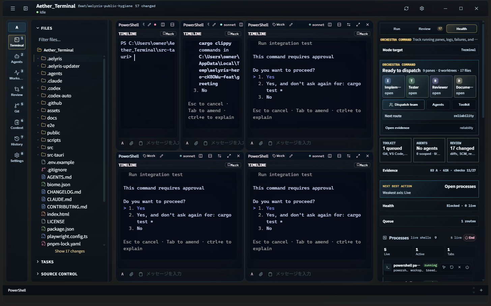

**English** | [日本語](README.ja.md)

# Aelyris



**Verifiable mission control for AI coding agents — local-first, visible, and exact-OID.**

Aelyris turns a plain-language development goal into a durable **Mission**. The backend owns planning, TaskGraph state, visible PTY execution, independent review, exact-commit merge, immutable completion packets, and restart recovery. Operators can watch the real agent terminals, intervene when needed, and inspect the durable evidence afterward.

> **Alpha — active development, not release-ready.**
> Aelyris does not turn a focused test into a marketing claim. Product and release claims stay behind runnable verifiers, exact Git provenance, and explicit operator/external gates.

## The verified Mission path

```text
plain-language Goal
        ↓
backend-owned planner
        ↓
durable Mission + TaskGraph
        ↓
visible AI CLI in an isolated git worktree
        ↓
fresh project gates
        ↓
fixed independent reviewer
        ↓
exact-OID merge
        ↓
CompletedWorkPacket + MissionCompletionPacket
        ↓
restart-safe current state, history, and completion receipt
```

This path has been exercised with a real Codex worker, visible PTY implementation, independent review, exact-OID merge, immutable settlement, worktree reclamation, and same-SQLite restart recovery. The Cockpit and MCP surfaces project the same backend owners; neither is allowed to invent a verdict, candidate OID, packet, or completion state.

## At a glance

| Area | Alpha capability |
| --- | --- |
| **Visible agent work** | One real interactive AI CLI per pane, observable and steerable while it runs |
| **Isolation** | Each orchestrated worker uses its own Git worktree and declared output/ownership lane |
| **Durable Missions** | Goal, plan, TaskGraph, execution state, review lineage, settlement packets, and current Mission restore from SQLite |
| **Review and merge authority** | Fixed independent review, mechanical gates, exact-candidate binding, old-OID compare-and-swap merge |
| **Completion truth** | A task is not complete without its immutable `CompletedWorkPacket`; aggregate completion requires `MissionCompletionPacket` |
| **Mission history** | Bounded newest-first history distinguishes the current incomplete Mission from prior packet-backed completion |
| **Two product faces** | Human Cockpit and typed MCP/JSON-RPC control plane over the same Rust owners and governance boundary |
| **Native terminal substrate** | Rust-owned ConPTY sessions, input, clipboard, IME, scrollback, pane graph, and session lifecycle |
| **Windows packaging** | Local unsigned EXE, NSIS, and MSI smoke artifacts; formal signing/publication remains gated |

## Why Aelyris

Running several coding agents is easy. Knowing what each agent is doing, keeping their changes separate, proving what was tested, and merging only the reviewed commit is the hard part.

Aelyris treats those concerns as product primitives:

- **Visible instead of hidden** — the real agent session is the operator surface and the debugging record.
- **Project-first instead of chat-first** — Missions bind work to a repository, TaskGraph, branches, outputs, evidence, and Git identity.
- **Backend-owned authority** — the AI may request planning, execution, or review, but it cannot author its own verdict, merge token, or completion packet.
- **Exact evidence instead of labels** — “done” is not a string on a card; it is a validated packet lineage tied to the exact integrated OID.
- **Provider-neutral by design** — visible PTY remains the current best execution path. OpenCode or another structured runtime is not required and is admitted only if it proves a material advantage without duplicating Aelyris owners.
- **Local-first** — terminals, worktrees, SQLite state, audit, and control surfaces run on the operator’s machine.

## What works today

### Visible terminal fleet

- Compatible coding-agent CLI processes run inside visible terminal panes. Codex has current real-provider Mission evidence; provider-specific parity remains separately gated.
- Each pane is backed by Rust-owned native session state rather than scraped browser terminal text.
- The multiplexer owns workspace/window/tab/pane topology, splits, zoom, synchronized input, bounded capture, scrollback, and restart adoption.
- Agent and terminal lifecycle reads are value-minimized; raw scrollback is exposed only through the explicitly sensitive terminal-capture boundary.

### Durable Mission OS

- Plain-language Goal planning through the backend-owned planner.
- Atomic Mission + TaskGraph acceptance.
- Visible work dispatch through the existing PaneFleet and worktree owners.
- Fresh gate execution and independent review.
- Exact candidate freeze, merge intent, exact-OID merge, immutable settlement, durable completion event, and cleanup.
- Restart-safe `mission.current`, bounded `mission.history`, and packet-backed `mission.completion` projections.
- Cockpit Mission history with explicit current/incomplete/completed/inconsistent states and a read-only receipt inspector.

### Coordination and governance

- File and symbol ownership with conflict detection and leases.
- Shared decisions, typed intents, durable events, blockers, activity, and knowledge-graph impact queries.
- Principal-scoped discovery and authorization.
- Payload-minimized audit for mutations and coordination reads.
- Cost caps and honest fail-closed admission when a configured usage axis is not owned by trustworthy telemetry.

### AI self-operation

The supported Mission sequence is available through typed MCP tools:

```text
aelyris.mission.plan
aelyris.mission.current
aelyris.mission.run_next
aelyris.mission.review_and_settle
aelyris.mission.completion
aelyris.mission.history
aelyris.mission.replay
aelyris.mission.replay_timeline
```

The caller supplies only the bounded identity or Goal fields required for each step. Planner selection, TaskGraph authority, reviewer identity, verdict, candidate OID, merge authority, and packet creation remain backend-owned.

`aelyris.mission.replay` is observation-only: it returns the current Mission's deterministic replay hash, bounded durable-source counts, and zero-effect guarantees without returning raw Task, execution, event, OID, review, or packet payloads.

`aelyris.mission.replay_timeline` reduces and validates the complete Mission history first, then returns only a server-bounded newest checkpoint window with status counts and canonical hashes. It exposes no event identity/payload and grants no recovery or rollback authority.

## Honest boundaries

Aelyris is still alpha.

- Formal **Authenticode**, updater signing, `.sig`/`latest.json`, publication, and update-endpoint evidence are not closed.
- Real installer install/relaunch/upgrade/rollback certification is still an operator gate.
- Real Windows sleep/resume and selected external A9 certification remain separate evidence.
- The current UI is Tauri/React/WebView2 around a native Rust terminal/runtime substrate. Full-native UI migration is parked until the reusable **Alyce** framework and its activation evidence are ready.
- Conflict avoidance protects Aelyris-owned orchestration lanes; arbitrary external Git edits can bypass those controls.
- Aelyris coordinates existing coding-agent CLIs; it does not replace the models or the operator’s final judgment.
- Windows is the primary supported platform today.

## Roadmap direction

The immediate order is value-first:

1. Close remaining operator/external release certification.
2. Keep visible PTY as Current Best unless a structured runtime proves a material advantage; `promote_none` is a valid outcome.
3. Build deterministic Mission replay/recovery from existing durable owners — no second journal, TaskGraph, or packet store.
4. Expand verified Proofbooks, remote continuity, and governed multi-client operation only through separately approved boundaries.
5. Move the product UI toward full-native Rust after Alyce is ready and the measured migration gate opens.

## Tech stack

- **Tauri v2** — Rust backend with a React/WebView2 Cockpit
- **Rust** — Tokio, Git2, rusqlite, native Windows APIs, ConPTY
- **Frontend** — React 19, TypeScript, Vite 7, CSS Modules, Radix primitives
- **Editor** — Monaco with Vim mode
- **Control plane** — authenticated REST, MCP, and JSON-RPC projections over shared owners
- **Packaging** — Windows EXE, NSIS, MSI, updater contract, release doctor

## Requirements

- Windows 11 recommended
- Rust MSVC toolchain
- Node.js 24+
- pnpm 10+
- WebView2 Runtime
- At least one compatible AI coding-agent CLI for live agent work

## Development

```powershell
git clone https://github.com/vellyalis/aelyris.git
cd aelyris
powershell -NoProfile -ExecutionPolicy Bypass -File scripts/bootstrap-development.ps1
corepack pnpm tauri dev
```

The bootstrap checks the local toolchain, performs a frozen dependency install, reconstructs ignored continuation state from tracked Git truth, and runs the fresh-clone gate. It does not copy another machine’s credentials, tokens, signing material, or generated evidence.

Automated UI verification must not steal the operator's foreground window. Use `corepack pnpm tauri:dev:verification` for the hidden, non-focusing Tauri runtime; ordinary `tauri:dev` is for deliberate interactive development only.

## Build

```powershell
corepack pnpm build
corepack pnpm tauri:build:dist
```

The canonical Windows distribution wrapper builds the Rust PTY sidecar and produces local unsigned NSIS/MSI artifacts. Unsigned local artifacts are smoke evidence, not a release claim.

## Verification

Focused development lane:

```powershell
corepack pnpm verify:fast
cargo check --manifest-path src-tauri/Cargo.toml --lib
corepack pnpm verify:mcp-orchestrator
corepack pnpm verify:ai-decision-knowledge
```

Distribution and release evidence:

```powershell
corepack pnpm verify:dist
corepack pnpm verify:release:doctor
corepack pnpm verify:supply-chain
corepack pnpm verify:stack-risk
corepack pnpm verify:goal:safe:no-token
```

Cross-PC continuation:

```powershell
corepack pnpm bootstrap:continuation
corepack pnpm verify:product-delivery:continuation
corepack pnpm verify:cross-pc-continuation
```

Do not infer current readiness from prose or an old score artifact. Regenerate the relevant gate on the exact current HEAD.

## Documentation

- [GitHub introduction and About copy](docs/GITHUB_INTRODUCTION.md)
- [Documentation index](docs/README.md)
- [Contributor workflow](docs/AGENT_WORKFLOWS.md)
- [Publication readiness](docs/PUBLICATION_READINESS.md)
- [Requirements and claim policy](docs/requirements.md)
- [Specification index](docs/specs/README.md)
- [MCP tool surface](docs/specs/MCP_TOOL_SURFACE_SPEC.md)
- [Visible agent runtime](docs/specs/VISIBLE_AGENT_PANE_RUNTIME_SPEC.md)

## Naming

- Product: **Aelyris**
- Read as: **Aelys** / **エイリス**
- CLI / short name: `aelys`
- Coordination engine: **Qralis**

## Contributing

Read `AGENTS.md` and `CONTRIBUTING.md` before changing the repository. Keep requirements, implementation, tests, verifiers, and public claims aligned. Do not add a second owner for Mission, TaskGraph, PTY, review, merge, packets, or durable state.

## License

See [LICENSE](LICENSE).
